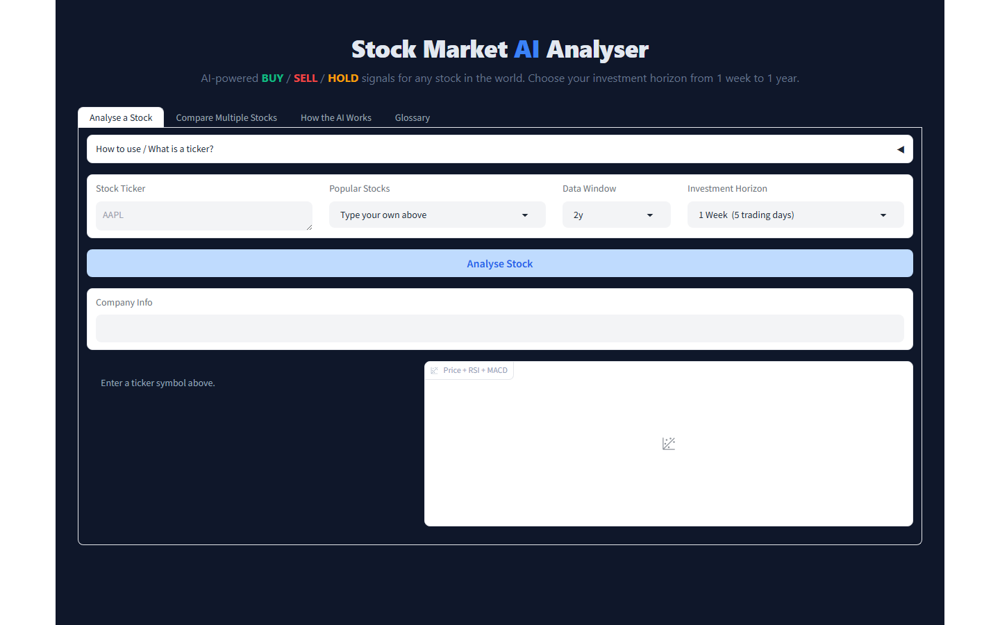

# AI Stock Analysis & Recommendation Platform

> ## ⚠️ IMPORTANT DISCLAIMER
>
> **This project is for EDUCATIONAL and RESEARCH purposes only.**
>
> It is **NOT financial advice**. It is **NOT** a recommendation to buy or sell any security.
> Past model metrics do not guarantee future results. Do not use this tool as the sole basis
> for investment decisions. Consult a qualified financial professional before investing.

Production-style research stack: **CatBoost Sniper v5** predicts ~10-trading-day direction from price, volume, VIX, and sentiment. A **decision layer** blends that ML score with trend and volatility-risk agents. Training uses a **reproducible sentiment proxy**; live analysis uses **GDELT headlines** (VADER or FinBERT). Served with FastAPI, Gradio, Docker, MLflow, and CI.

[](https://github.com/PrathamBhat-prog/AI-Stock-Analysis-Recommendation-Platform/actions/workflows/ci.yml)



---

## Highlights

| Capability | Details |
|------------|---------|
| **Sniper v5** (CatBoost `.cbm`) | Binary classifier: P(close higher in ~10 trading sessions) |
| **Dual-path sentiment** | Train: market proxy + optional yfinance headlines. Serve: live GDELT + VADER/FinBERT |
| **Multi-agent pipeline** | ML + trend (price-structure signals) + risk (realized vol) + horizon-weighted decision |
| **Position sizing** | Inverse-volatility scaling, 10% base idea size, hard cap 20% |
| **Honest horizons** | Keys are **trading days** (see below). Long views are trend-led, not an ML annual forecast |
| **MLOps** | MLflow training logs, optional inference logging, Docker Compose, GitHub Actions pytest |
| **Quality** | Per-ticker chronological splits, winsorization, validation-only threshold, walk-forward backtest script |
| **Stack** | Free/open data and libraries — yfinance, GDELT, CatBoost, FastAPI, Gradio |

Held-out metrics after each train live in `artifacts/models/sniper_metadata.json` and are shown in the Gradio model panel (not hardcoded).

**Latest held-out test (32 tickers × 10y, proxy sentiment, threshold 0.43):** accuracy **53.8%**, precision **53.8%**, ROC-AUC **0.50**. Directional edge on public features is modest; the product is the pipeline and the honest horizon messaging, not a claim of market-beating alpha.

---

## What does the model predict?

The **ML model** answers one question: *is the close likely higher in about **10 trading days**?*

The **UI/API** also offers 5d / 21d / 63d / 126d / 252d views. Those are **not** five separate neural nets. They are the same 10-day probability **blended** with trend analysis, with ML weight falling as the horizon lengthens (`src/config/horizons.py`).

### Why 5d, 21d, 63d, 126d, 252d (not arbitrary)

US cash-equity practice counts **sessions**, not calendar dates. A typical year has about **252** trading days (weekends and market holidays excluded). That 252 figure is the same convention used to annualize volatility and Sharpe-style ratios.

| Key | Trading sessions | Rough calendar analogue | Why this number |
|-----|------------------|-------------------------|-----------------|
| `5d` | 5 | ~1 week | One full trading week |
| `21d` | 21 | ~1 month | ~252 / 12 |
| `63d` | 63 | ~1 quarter | ~252 / 4 |
| `126d` | 126 | ~6 months of sessions | **half of 252** — six months of market days, **not** 126 calendar days |
| `252d` | 252 | ~1 year of sessions | **full trading year**, **not** 252 calendar days (~365) |

So `126d` and `252d` look “round in base-10” only because they are **halves and the annual session count**, not because someone picked 126 at random.

| Key | ML weight | Trend weight | Role |
|-----|-----------|--------------|------|
| `5d` | 80% | 20% | Short-term bias (closest in *spirit* to a short ML horizon) |
| `21d` | 50% | 50% | **Default** — nearest product view to the 10-day training label |
| `63d` | 30% | 70% | Trend-led quarter |
| `126d` | 15% | 85% | Trend over ~6 months of sessions |
| `252d` | 10% | 90% | Trend over ~1 year of sessions — **not** an ML annual price target |

**Decision layer:** BUY if blended score ≥ 0.58, SELL if ≤ 0.42. High realized volatility can downgrade BUY → HOLD.

---

## Architecture

```
Training:  yfinance OHLCV + ^VIX + sentiment proxy  →  CatBoost (.cbm)
Inference: live OHLCV + VIX + GDELT headlines       →  same 10 features → P(up)
Agents:    ML + Trend + Risk  →  horizon blend  →  inverse-vol size  →  FastAPI / Gradio
```

**Training vs serving sentiment:** a 10-year daily news panel from public APIs is sparse and unstable. Training therefore uses a **backward-looking** price/volume proxy (plus at most one yfinance news blend per ticker). At inference, users get **current** GDELT (yfinance news fallback) scored with VADER, or FinBERT when `transformers` is installed (`SENTIMENT_BACKEND=auto`).

**Features (10):** 20d momentum, distance from 52-week high, 20d rolling sentiment, 5d volume ratio, VIX, sentiment lags 1/3/5, sentiment×VIX, 5d VIX velocity.

**Universe:** 32 names (24 US + 8 India `.NS`) in `DEFAULT_TRAIN_TICKERS`.

See [Architecture](docs/ARCHITECTURE.md).

---

## Quick start

```powershell
git clone https://github.com/PrathamBhat-prog/AI-Stock-Analysis-Recommendation-Platform.git
cd AI-Stock-Analysis-Recommendation-Platform
python -m venv venv
.\venv\Scripts\Activate.ps1
pip install -r requirements.txt

python scripts/setup_model.py
python train.py --strategy sniper --period 10y
python verify_pipeline.py
pytest tests/ -v
```

```powershell
uvicorn src.main:app --reload --port 8000    # OpenAPI: :8000/docs
python -m src.ui.gradio_app                  # UI: :7860
```

```powershell
docker compose up --build
```

Trained weights are **not** stored in git (regenerate with `train.py`). `scripts/setup_model.py` copies a local `.cbm` if you already have one.

---

## Training

| Command | Purpose |
|---------|---------|
| `python scripts/run_production_pipeline.py` | Train + print held-out metrics |
| `python train.py --strategy sniper --period 10y` | Production CatBoost (`sentiment_mode=proxy`) |
| `python train.py --strategy sklearn --period 10y` | Research: 8 candidates (7 tabular + LSTM), 20-day labels |
| `python train.py --strategy backtest --period 10y` | Walk-forward backtest (10 bps costs) |

**Outputs:** `artifacts/models/trading_model_sniper_v5.cbm`, `sniper_metadata.json`.

### Split and regularisation

- Per-ticker **chronological** 70/15/15 (no shuffle; each listing has its own past/future)
- CatBoost **early stopping** on validation AUC (`use_best_model=True`)
- Feature **winsorization** at the 1st/99th percentile
- Classification **threshold tuned on validation F1 only**; test is scored once at the end

---

## API

| Method | Path | Description |
|--------|------|-------------|
| GET | `/health` | Health check |
| GET | `/horizons` | Horizon weights, trading-day definitions, disclaimers |
| POST | `/analyze` | Single ticker |
| POST | `/analyze/batch` | Up to 20 tickers |

---

## Configuration

| Variable | Default | Purpose |
|----------|---------|---------|
| `SNIPER_MODEL_PATH` | `artifacts/models/trading_model_sniper_v5.cbm` | Model file |
| `SENTIMENT_BACKEND` | `auto` | `vader` \| `finbert` \| `auto` |
| `ENABLE_INFERENCE_MLFLOW` | `false` | Per-request MLflow logging |

---

## Repository map

| Path | Role |
|------|------|
| `src/data/sniper_dataset.py` | Features, 10-day labels, dataset build |
| `src/data/sentiment_proxy.py` | Training-time sentiment |
| `src/data/news_fetcher.py` | Live GDELT (+ fallback) |
| `src/models/sniper_trainer.py` / `sniper_predictor.py` | Fit / load `.cbm` |
| `src/agents/` | ML, trend, risk, decision blend |
| `src/risk/position_sizer.py` | Inverse-vol suggestion |
| `src/config/horizons.py` | Trading-day horizons (single source of truth) |
| `src/main.py` | FastAPI |
| `src/ui/gradio_app.py` | Dashboard (screenshot above) |
| `tests/` | CI |

---

## Documentation

| Document | Description |
|----------|-------------|
| [Architecture](docs/ARCHITECTURE.md) | Training vs inference paths |

---

## Author

**Pratham Bhat** — [PrathamBhat-prog](https://github.com/PrathamBhat-prog)

## License

MIT — see [LICENSE](LICENSE)
